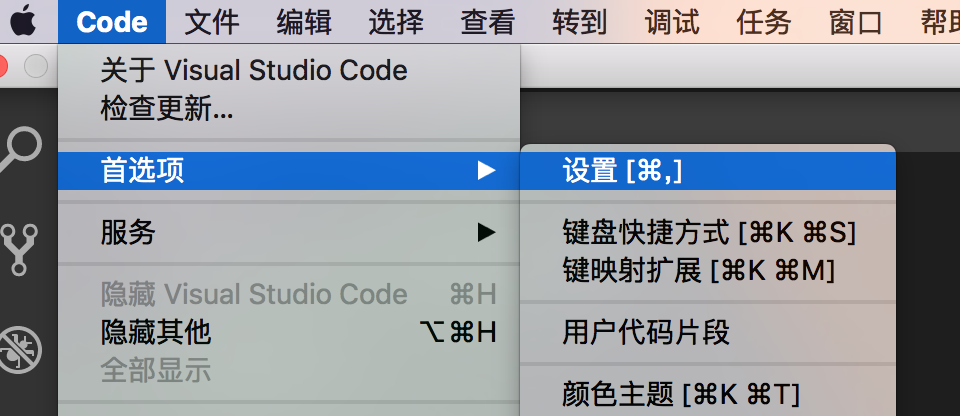
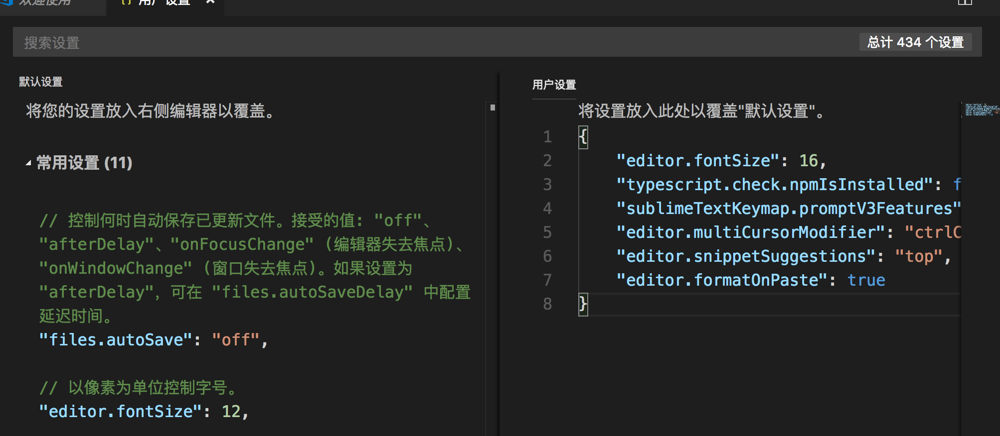
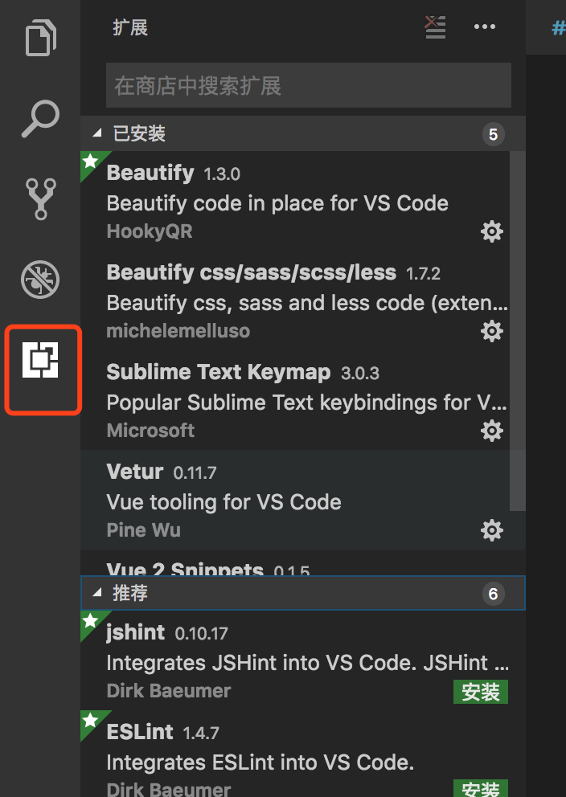

# HTML基础

## 1 选择一款自己喜欢的IDE

### 1.1 IDE汇总
- VScode
- sublime
- Atom
- baket

### 1.2 vscode

#### 1.2.1 下载地址
[vscode 下载](https://code.visualstudio.com/docs/setup/setup-overview)
#### 1.2.2 用户设置
code=>首选项=>设置：
  

里面分为软件默认设置和用户设置两大类：

删除右侧用户设置，将恢复至软件默认设置。

#### 1.2.3 常用插件推荐
布局左侧底部为“插件”选项，可在里查看已安装的插件和系统推荐的插件。

- HTML常用设置
    - 插件
        系统默认支持了emmt，在用户设置中添加： "emmet.triggerExpansionOnTab": true；增加对非W3C样式标签的支持。

        Auto rename tag:  自动修改对应标签的内容，并完成闭合。

    - 常用快捷键:  format:  使用系统常用快捷键

- CSS常用设置
    - 插件,css没有自带的format工具，所以需要自行安装：
            * Beautify                                   
    - 常用快捷键 format:  使用系统常用快捷键

- JavaScript常用设置
    - 2.3.1插件
        VUE 相关：
    - 常用快捷键
        format:  使用系统常用快捷键

#### 1.2.4 系统常用快捷键

- [mac下快捷键](keyboard-shortcuts-macos.pdf)

- [windows下快捷键](keyboard-shortcuts-windows.pdf)
